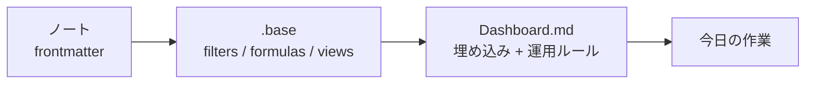

# ObsidianでBasesとDashboardを活用して情報管理を行う

%%
- 想定読者：Obsidianでノートは増えてきたが、Basesをまだ使っていない／作ってみたが運用に乗らなかった人
- 一番伝えたいこと：Baseは「データの抽出」、Dashboardは「人が判断する画面」。この分担さえ守れば、プラグインなしでも情報管理は回る
- 元ノート：[[PublicKnowldgeNote/Articel/Obsidianのノート管理は「フォルダ中心」から「Dashboard中心」へ]]
%%

## はじめに

Obsidianでノートが増えてくると、必要なのは検索ではなく状態の一覧になる。

「あのノートはどこか」はクイック検索で解決する。しかし「まだ手をつけていないノートはどれか」「公開したのに情報が抜けている記事はどれか」は、検索では出てこない。ファイル名を覚えていないものは探せないからだ。

この問題に対して、以前は「フォルダではなくDashboardを入口にする」という考え方を整理した。ただ、考え方だけでは実際のファイルは作れない。

この記事では、Obsidian標準機能のBasesを使って、実際に自分のVaultで作った4つのBaseと、それを埋め込んだDashboardの中身を書く。プラグインは使っていない。

## BasesとDashboardの役割分担

最初に決めておきたいのは、どちらに何を書くかだ。

- **Base（`.base`ファイル）** … 条件でノートを抽出し、列を組み立て、並べ替える。データを作る側。
- **Dashboard（Markdownノート）** … Baseのビューを埋め込み、「これは何の一覧か」「いつ見るか」「上から何をするか」を書く。人が読む側。

Baseファイルは直接開いても一覧が見られる。それでもDashboardを別に作るのは、一覧そのものには意味の説明が書けないからだ。



Baseを「SQLのビュー」、Dashboardを「その結果を並べた画面」と考えると分かりやすい。

## 実際に作った4つのBase

自分のVaultでは、いまのところ次の4つを運用している。

| Base | 対象 | 主に見たいこと |
|---|---|---|
| `_ArticleBases.base` | 公開記事の原稿 | 執筆中・公開待ちの記事、公開情報の記入漏れ |
| `wiki.base` | 業務Wiki | カテゴリ別一覧、更新が古いページ |
| `goals.base` | 人生の目標 | 領域別の進捗、期限までの残日数 |
| `ideas.base` | 記事・企画のアイデア | 状態のカンバン、寝かせすぎている種 |

分野ごとに1つ、というより「同じプロパティと同じ処理フローを共有するノート群ごとに1つ」で切っている。記事とアイデアは別のBaseだが、どちらも最終的な出力は記事なので、DashboardからはIdeas側へリンクしてつないでいる。

## Baseの中身は4つの要素でできている

`.base`ファイルはYAMLで書く。要素は大きく4つだ。

### 1. filters — どのノートを対象にするか

記事Baseでは、フォルダとファイル種別で絞り、Dashboard自身とREADMEを除外している。

```yaml
filters:
  and:
    - file.inFolder("PublicKnowldgeNote/Articel")
    - file.ext == "md"
    - file.name != "_Article DashBoard"
    - file.name != "README"
```

一方、目標やアイデアのBaseはフォルダではなく`type`プロパティで絞っている。

```yaml
filters:
  and:
    - type == "life-goal"
    - status != "dropped"
```

フォルダで絞るか、プロパティで絞るか。ノートの置き場所が固定されているならフォルダ、複数の場所に散るならプロパティがよさそうだ。

### 2. formulas — 生のプロパティにない列を作る

ここがBasesで一番おもしろい部分だと思う。frontmatterに書いていない値を、計算して列にできる。

自分がよく使っているのは3種類だ。

**状態を絵文字付きラベルに変える**

```yaml
formulas:
  status_label: if(status == "published", "✅ 公開済み", if(status == "ready", "🚀 公開待ち", if(status == "draft", "✍️ 執筆中", if(status == "idea", "💡 アイデア", "⚠️ 要確認"))))
```

`status`は`draft`のような機械向けの値のままにしておきたい。しかし一覧で見るときは日本語とアイコンの方が速い。表示だけを式で変える。

**経過日数を出す**

```yaml
  days_since_update: (today() - file.mtime).days
```

`file.mtime`のような組み込みプロパティが使えるので、更新日をfrontmatterに書いていなくても「何日止まっているか」は出せる。

**入力漏れの理由を文章で出す**

```yaml
  attention_reason: if(status.isEmpty(), "status 未設定", if(status == "published" && note["post date"].isEmpty(), "投稿日未入力", if(status == "published" && 投稿先.isEmpty(), "投稿先未入力", if(status == "published" && 投稿先URL.isEmpty(), "URL未入力", ""))))
```

これが結果的に一番役に立った。「何か変だ」ではなく「投稿日未入力」と表示されるので、開かなくても直すべき場所が分かる。

なお、スペースを含むプロパティ名は`note["post date"]`のように書く必要がある。

### 3. properties — 列の見出しを日本語にする

プロパティ名は英語のまま、表示だけ日本語にできる。

```yaml
properties:
  status:
    displayName: ステータス
  formula.days_since_update:
    displayName: 更新からの日数
  post date:
    displayName: 投稿日
```

frontmatterのキーを日本語にすると、あとでスクリプトから触るときに面倒になる。表示名だけ分けておくのがよいと思う。

### 4. views — 同じデータを複数の切り口で見る

1つのBaseに複数のビューを持てる。これがフォルダ分けの代わりになる部分だ。

記事Baseには7つのビューを置いている。

- 要確認（入力漏れがあるもの）
- 公開待ち
- 執筆中
- アイデア
- 公開済み
- 反応順
- 全件

ビューごとにfilters、列の順序、並び順、列幅を指定する。

```yaml
views:
  - type: table
    name: 執筆中
    filters:
      and:
        - status == "draft"
    order:
      - file.name
      - formula.status_label
      - formula.days_since_update
      - file.mtime
    sort:
      - property: file.mtime
        direction: ASC
    columnSize:
      file.name: 430
```

`sort`を`ASC`にしているのは意図的だ。執筆中の記事は、新しいものより長く放置しているものを先に見たい。

`type`には`table`のほかに`cards`が使える。アイデアのようにざっと眺めたいものはカード表示にして、`groupBy`でカンバンにしている。

```yaml
  - type: cards
    name: カンバン
    groupBy:
      property: status
      direction: ASC
```

数値列がある場合は`summaries`で集計も出せる。

```yaml
    summaries:
      progress: Average
```

## Dashboardへ埋め込む

Baseができたら、Markdownノートに埋め込む。書式はビュー名を`#`で指定するだけだ。

```md
## 今見るべきもの

### 要確認

`status` が未設定・想定外、または公開済みなのに投稿日・投稿先・URLのいずれかが未入力の記事。

![[_ArticleBases.base#要確認]]

### 公開待ち

推敲を終え、公開作業を待っている記事。

![[_ArticleBases.base#公開待ち]]
```

記事Dashboardは「今見るべきもの」「次に育てるもの」「一覧」の3段構成にしている。上から順に見れば作業が決まるようにしたかった。

Dashboardの冒頭にはcalloutで運用の注意も書いている。

```md
> [!note]
> `_ArticleBases.base` を使って、記事を「次に処理する順」と状態別に見る。
> ステータスと公開情報の運用ルールは [[README]] を参照する。
> 反応数は `反応取得日` 時点のスナップショットとして表示する。
```

数値の意味や更新のタイミングは、表の中には書けない。この種の前提をDashboard側に書けるのが、Baseファイルを直接開くのとの違いだと思う。

## 運用してみて効いたところ

### 「要確認」ビューが一番使われている

作る前は、状態別の一覧が主役だと思っていた。実際に一番開くのは「入力漏れ」を集めたビューだった。

記録の抜けは、意識しても防げない。あとで拾えるようにする方が現実的だった。

### ファイルを移動しなくなった

`status`を`draft`から`published`へ書き換えるだけで、記事は自動的に別のビューへ移る。フォルダ移動もファイル名変更も必要ない。

「進捗をフォルダで表さない」というルールが、Basesによって実際に守れるようになった。

### 鮮度が可視化される

Wiki Baseでは、更新日からの経過で色を付けている。

```yaml
  freshness: if(!updated, "❓", if((today() - date(updated)).days > 180, "🔴", if((today() - date(updated)).days > 90, "🟠", "🟢")))
```

古いページは、探しに行かない限り古いままになる。一覧に🔴が並ぶと、直す気になる。

## 気をつけたいこと

### ビューを増やしすぎる

記事Baseは7ビューあるが、正直これが上限に近い。ビューが多いとタブを選ぶ時間が増える。「今見るべきもの」を3つに絞れないなら、切り口が整理できていないのだと思う。

### 一覧で使わないプロパティを作る

欲しいビューから逆算してプロパティを決める。先にプロパティを揃えると、埋めるだけで使われない項目が残る。

### formulaに運用ルールを書き込みすぎる

`attention_reason`は便利だが、条件を足すほど式が読めなくなる。ルール本体はREADMEに書き、formulaは検出だけを担当させるくらいがよさそうだ。

### スナップショットを最新値だと思ってしまう

noteのスキ数のような外部の数値は、取得した時点の値でしかない。取得日を必ず併記して、Dashboardにもその旨を書いておく。

## 小さく始めるなら

1. ノートが多くて困っている分野を1つ選ぶ
2. その分野で知りたい状態を3つだけ決める
3. 足りないプロパティをfrontmatterに足す
4. `.base`を作り、filtersとビュー3つを書く
5. Markdownノートに埋め込み、各ビューに1行の説明を付ける
6. 週に一度開いて、実際に上から処理する

最初のBaseは、filtersとviewsだけでよい。formulasやdisplayNameは、運用してみて「この列が欲しい」と思ったときに足せばいい。

## まとめ

BasesとDashboardの使い分けは、次の一行に収まる。

**Baseはデータを抽出する。Dashboardは人が判断する。**

Baseに書くのはfilters、formulas、properties、viewsの4つ。Dashboardに書くのは埋め込みと、その一覧をいつ何のために見るかという説明だ。

そして、作るべきビューで最優先なのは、きれいな分類ではなく「抜けているものが集まる場所」だと思う。ノートが増えて困るのは数そのものではなく、処理されていないノートが見えないことだからだ。

Obsidianの標準機能だけで、ここまでは作れる。

## 参考・関連ノート

- [[PublicKnowldgeNote/Articel/Obsidianのノート管理は「フォルダ中心」から「Dashboard中心」へ]]
- [[PublicKnowldgeNote/Articel/Obsidianで読書管理DashBoardを作った話]]
- [[PublicKnowldgeNote/Articel/Obsidianは「保管庫」ではなく「変換装置」として使う]]
- [[PublicKnowldgeNote/Articel/Obsidianの運用方法]]
- [[PublicKnowldgeNote/Articel/README|Articel 記事管理ルール]]
