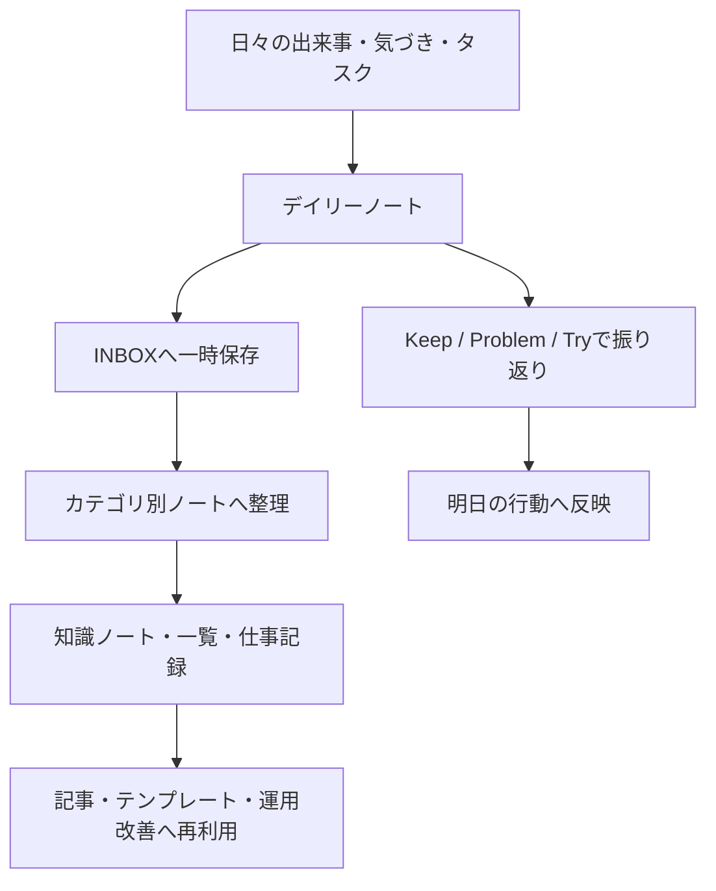

# Obsidianの運用方法

## Obsidianとは？

ObsidianはMarkdownベースでノートを管理できるアプリです。  
テキストファイルをそのまま扱えるので、専用サービスに閉じず、自分の運用に合わせて育てていけるのが大きな強みです。

ただし、自由度が高いぶん「結局どう運用すればいいのか」が難しいとも感じます。  
私も最初はノートを増やすだけで、後から見返せない、どこに何を書くか迷う、という状態になりがちでした。

そこで今は、`日次ノートを起点にして、情報を受けて、整理して、再利用する` という流れで運用しています。  
この記事では、現在の自分のObsidian運用を叩き台としてまとめます。

## なぜ運用方法が必要なのか

Obsidianは便利ですが、ただノートを増やすだけだと次のような問題が起きやすいです。

- とりあえずメモするが、後で見返さない
- フォルダやノートの置き場が毎回ぶれる
- アイディアや学びが記録止まりで終わる
- 長期目標と日々の行動がつながらない

つまり、問題は「記録できないこと」ではなく、`記録したものをどう流すか` が決まっていないことです。

記録することで後で見直せるようにするとことでは価値はあると思いますね。ただ、それだけだと価値が小さいです。

今は次の4つを回せるようにすることを意識しています。

- 毎日の行動管理
- 振り返りと改善
- 情報の整理と保管
- 記事や知識としての再利用

## 全体の運用フロー

現在の個人的運用をざっくり図にすると、次のようになります。


![[Obsidianの運用方法_画像.png]]

ポイントは、最初から完璧に整理しないことです。  
まず受ける。あとで整理する。最後に再利用できればよい、という考え方で回しています。

## 運用の中心はデイリーノート

今の運用の中心はデイリーノートです。  
日付ごとのノートを作り、その日1日の行動と振り返りをここに集約しています。

デイリーノートには主に次の項目があります。

- 目標の確認
- 今日注力すること
- Dailyタスク
- 出来事・やったこと
- 読了記事・動画
- 食事記録
- 明日のタスク
- Keep / Problem / Try

この形にしているのは、予定管理と振り返りを別々の場所でやると続きにくいからです。  
1日の行動管理と反省を1枚で完結させると、運用コストがかなり下がります。

## すぐ整理できない情報はINBOXに入れる

日々記録していると、「今すぐ整理するほどではないが、捨てたくない情報」が大量に出てきます。  
これをその場で分類しようとすると、今度は記録が止まります。

そこで、まずはINBOXに入れるようにしています。

- 汎用の一時置き場: `000_Inbox/`
- アイディア: `006.アイディア/アイディアINBOX.md`
- 行ってみたい店: `004_List/飲食店List/00. 行ってみたいお店INBOX.md`
- 仕事上の気づき: `005.記録/仕事記録.md` の INBOX

この運用の利点は、`整理できないから書かない` を防げることです。  
書くことと整理することを分けるだけで、かなり続けやすくなります。

## フォルダごとに役割を持たせる

私のVaultでは、各フォルダにだいたい次の役割を持たせています。

```text
001_Review    日次レビュー、目標、習慣、振り返り
003_Output    記事ネタ、公開用アウトプット
004_読書      読書メモ、読後まとめ
004_List      店、施設、ツールなどの一覧
005.記録      自分記録、仕事記録、イベント、勉強会
006.アイディア 事業案、記事案、アプリアイディア
100_Work      実案件、会議記録、仕事メモ
000_Inbox     未整理メモの一時置き場
```

厳密に分類しきる必要はありませんが、`この情報はどの棚に置くか` の基準があるだけで迷いが減ります。

## 記録のゴールは資産化

個人的に、Obsidianの価値は「記録できること」そのものより、`後で使える形で残せること` にあると思っています。

例えば、次のようなものは資産候補です。

- 記事
- テンプレート
- 手順書
- 知識ノート
- 改善フロー
- アイディアの具体案

読書メモや仕事の学びも、あとで再利用できる形に直せば価値が大きくなります。  
そのため、記録したら終わりではなく、「これは何に転換できるか」を意識しています。

## AIと組み合わせると使いやすい

最近はObsidian単体ではなく、AIと組み合わせて使うことも増えました。

例えば次のような使い方です。

- デイリーノートの要約
- Keep / Problem / Try の整理
- 過去ノートを横断した傾向分析
- 記録内容から記事案を作る
- テンプレート改善の相談をする

記録は増えるほど、自力だけでは見返しにくくなります。  
そこでAIを補助に使うことで、「残したが使っていないノート」を減らしやすくなります。

## この運用の強み

この運用をしていて良いと感じるのは次の点です。

- 毎日の行動と長期目標がつながる
- 未整理情報の逃がし先がある
- ノートの置き場で迷いにくい
- テンプレートで記録品質をそろえやすい
- 記録を記事や知識に転用しやすい

一方で、弱点もあります。  
テンプレートを増やしすぎると重くなりますし、INBOXを放置すると当然散らかります。  
なので、`日次では記録を優先し、週次で整理する` くらいがちょうどいいと感じています。

## これからObsidianを始めるなら

もしこれからObsidianを始めるなら、最初から完璧な仕組みを作ろうとしなくていいと思います。  
まずは次の3つだけで十分です。

1. デイリーノートを1つ作る
2. INBOXを1つ作る
3. 週1回だけ見返す時間を取る

この3つが回り始めてから、読書テンプレートや一覧ノート、AI連携を足していけば十分です。

## おわりに

今の自分にとってObsidianは、単なるメモアプリではなく、`毎日の行動を整え、考えを蓄積し、将来使える形に変えるための作業場` になっています。

一言でいうと、今の運用は `デイリーノートを司令塔にして、INBOXで受け、カテゴリ別に整理し、知識資産に変える運用` です。

まだ改善途中ではありますが、少なくとも「何を書けばいいか分からない」「書いたけど活かせない」という状態はかなり減りました。

もしObsidianの運用に迷っているなら、まずは `日次` と `INBOX` から始めてみるのがおすすめです。


