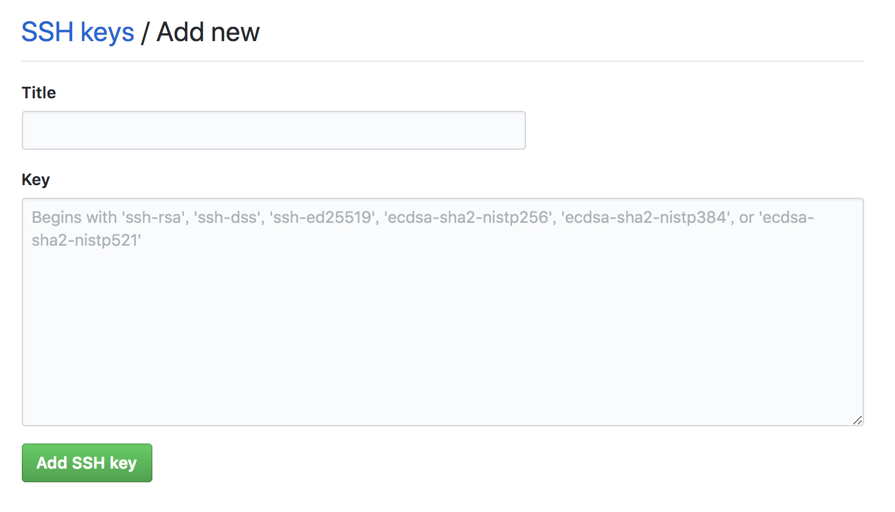

## 目的・用途
- GitHubなどのGit操作
- サーバーへのリモートログイン
- ポートフォワード（ローカル/リモート）

## 前提
- macOS標準のOpenSSHを利用
- `~/.ssh` 配下に鍵と `config` を置く

## SSHコマンド
SSH (Secure Shell) は、暗号や認証の技術を利用して安全にリモートコンピュータと通信するためのプロトコル。
```
$ ssh [オプション] ホスト名 [コマンド]
```
ホストに接続する例
```
$ ssh [ユーザー名]@[ホスト名]
$ ssh -i pemファイルパス root@VPSドメイン
```

### SSHコマンドの主なオプション
- `-p`：ポート番号を指定する
- `-l`：ログイン名を指定する
- `-i`：秘密鍵のファイルを指定する
- `-v`：詳細なログを表示する
- `-q`：ログを表示しない
- `-o`：設定を指定する
- `-b`：ローカルアドレスを指定する
- `-c`：暗号化方式を指定する
- `-m`：MACアルゴリズムを指定する
- `-N`：コマンドを実行しない
- `-T`：パスワード認証を行わない

## SSH
### ディレクトリ、ファイルの存在確認
```
$ ls -l ~/.ssh/config
```
上記で `~/.ssh/config` の有無を確認できる。

`~/.ssh`ディレクトリ、`~/.ssh/config`ファイルがない場合は作成する。
### SSHディレクトリ作成
ホームディレクトリ直下に `.ssh` を作成し、その中に `config` を作成する。
```
$ mkdir ~/.ssh
$ touch ~/.ssh/config
```

### パーミッション設定
```
$ chown -R $(whoami):staff ~/.ssh
$ chmod 700 ~/.ssh
$ find ~/.ssh -type f -exec chmod 600 {} \;
```
`.ssh` の権限を700（自分のみ読み書き可能）にする。  
`.ssh` 配下のファイルを600（自分のみ読み書き可能）にする。

### SSHキーの生成
```
$ ssh-keygen -t rsa

# 実行結果（抜粋）
Generating public/private rsa key pair.
Enter file in which to save the key (/Users/[username]/.ssh/id_rsa): git_work_rsa
Enter passphrase (empty for no passphrase):
Enter same passphrase again:
Your identification has been saved in git_work_rsa.
Your public key has been saved in git_work_rsa.pub.

```
- 生成キーの名前について
  - 同じ名前のキーがあると、上書きされる
  - `Enter file in which to save the key` の入力で鍵名を指定できる
- パスフレーズは設定推奨だが未設定でも生成可能
- SSH認証に使う秘密鍵（id_rsa）と公開鍵（id_rsa.pub）が生成される

### ホスト共通設定
```
$ open ~/.ssh/config

Host *
  StrictHostKeyChecking no
  UserKnownHostsFile ~/.ssh/known_hosts
  ServerAliveInterval 15
  ServerAliveCountMax 30
  AddKeysToAgent yes
  UseKeychain yes
  IdentitiesOnly yes
  LogLevel QUIET
```
- `StrictHostKeyChecking no` ホストキー確認を省略（セキュリティ上は非推奨）
- `UserKnownHostsFile ~/.ssh/known_hosts` 既知ホストの保存先
- `ServerAliveInterval 15` タイムアウト対策
- `ServerAliveCountMax 30` タイムアウト対策
- `AddKeysToAgent yes` 毎回パスフレーズを聞かれてくることに対する対策
- `UseKeychain yes` 毎回パスフレーズを聞かれてくることに対する対策
- `LogLevel QUIET` 警告メッセージを非表示にする
  - `Warning: Permanently added 'github.com,192.30.255.113' (RSA) to the list of known hosts.` このメッセージ。

### GitHubに公開鍵を登録する
**作成した公開鍵をコピーする**
```
$ pbcopy < ~/.ssh/id_rsa.pub
```
**GitHubへアクセスしSSH Keysを登録**
GitHubで `Settings` > [SSH and GPG keys](https://github.com/settings/keys) > `New SSH Key` と進み、`Key` に公開鍵を貼り付けて `Add SSH key`。



### 接続確認
```
$ ssh -T git@github.com
```

## ホスト別設定例
```
Host github.com
  HostName github.com
  User git
  IdentityFile ~/.ssh/id_rsa
  IdentitiesOnly yes

Host my-vps
  HostName example.com
  User ubuntu
  Port 2222
  IdentityFile ~/.ssh/my_vps_rsa
```

## ssh-agent／Keychain連携
```
$ ssh-add --apple-use-keychain ~/.ssh/id_rsa
```
- macOSのKeychainにパスフレーズを保存できる

## よくあるエラーと対処
- `Permission denied (publickey)`：鍵の指定漏れ・公開鍵未登録・権限不備を確認
- `Host key verification failed`：`~/.ssh/known_hosts` の該当行を削除して再接続
- `no matching host key type found`：サーバー側のアルゴリズム設定を確認

## セキュリティ
- パスフレーズを設定する
- 公開鍵のローテーションを定期的に行う
